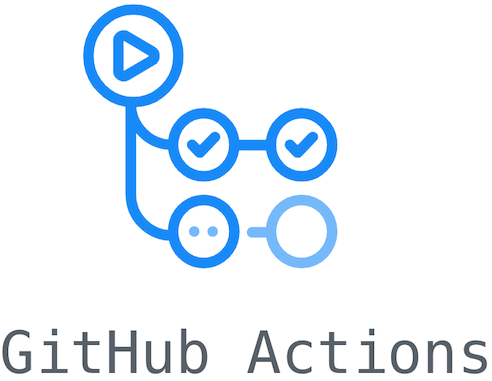

## Hi there 👋

- 📖  I'm currently studying Computer Science Engineer
- 👨🏽‍💻  Working on pet projects

## Contact with me 🙋🏽‍♂️

## SKILLS

  
  
  
  
  
  

  
  
<!--    -->

  
  

  
  
  
  
  

  
  
  
  
  

---

